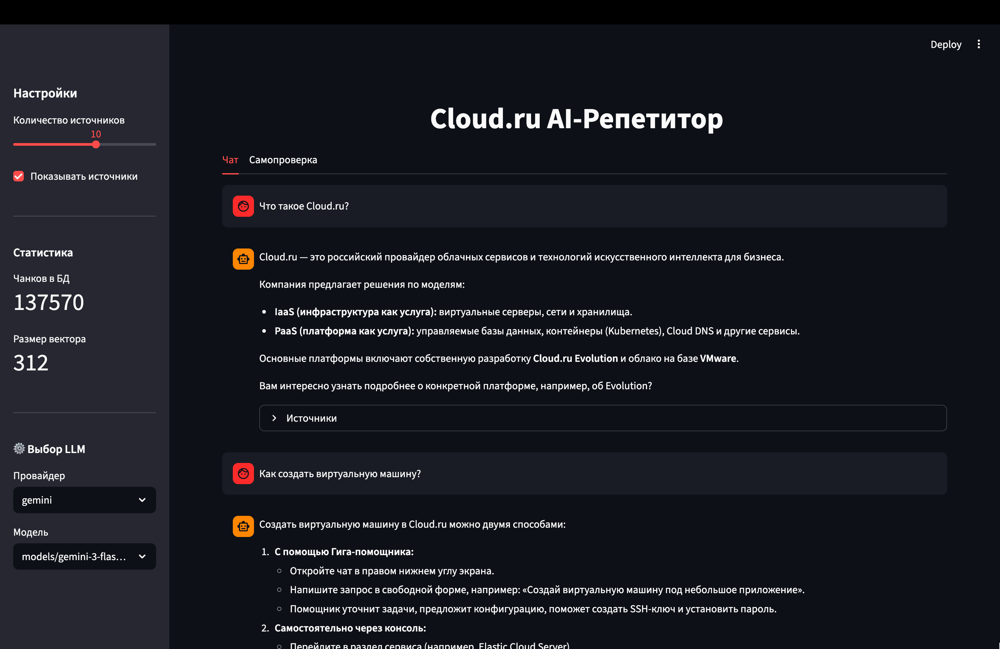
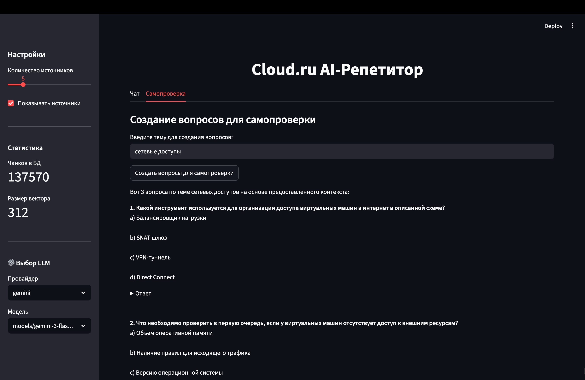
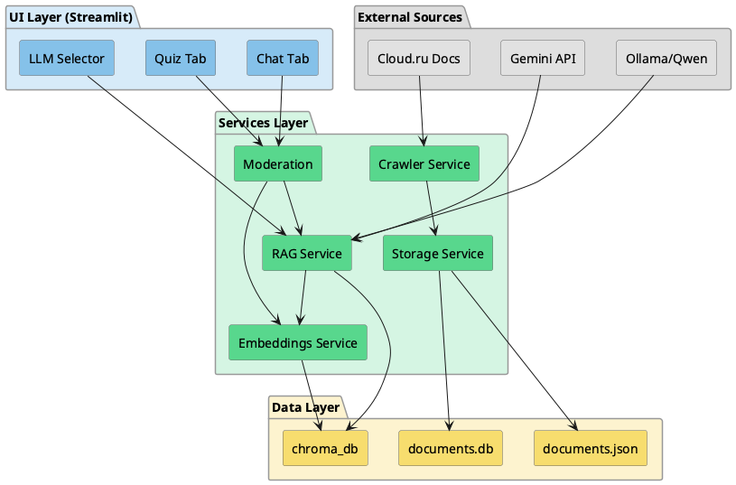

# Проблема

:::::::::::::: {.columns}
::: {.column width="60%"}

**Документация Cloud.ru — сложно:**

- 27k+ страниц технических материалов
- Нет персонализированного обучения
- Долгий поиск нужной информации
- Сложно проверить свои знания

:::
::: {.column width="40%"}

{ width=60% }

:::
::::::::::::::

::: notes
Представьте: новый разработчик хочет изучить Cloud.ru.
Тысячи страниц документации, десятки сервисов.
Где начать? Как понять, что усвоил материал?
:::

---

# Решение: AI-Репетитор

:::::::::::::: {.columns}
::: {.column width="50%"}

### Что умеет:

- Отвечает на вопросы по документации
- Показывает источники ответов  
- Генерирует тесты для самопроверки
- Работает с актуальной документацией

:::
::: {.column width="50%"}

### Ценность для бизнеса:

- **-70% времени** на поиск информации
- **Ускорение онбординга** новых сотрудников
- **Персонализация** обучения

:::
::::::::::::::

::: notes
AI-Репетитор — это умный помощник, который знает всю документацию Cloud.ru.
Он не просто ищет — он понимает контекст вопроса и формирует человеческий ответ.
Плюс генерирует тесты — можно сразу проверить, усвоил ли материал.
:::

---

# Режим чата

{ width=95% }

- Вопрос → ответ со ссылками на документацию
- Выбор LLM-провайдера (Gemini / Qwen)

::: notes
Режим чата — основной сценарий использования.
Задаёте вопрос — получаете ответ на человеческом языке.
К каждому ответу — ссылки на источники, можно проверить.
:::

---

# Генерация тестов

{ width=95% }

- Указываете тему → репетитор создаёт вопросы
- Варианты ответов + объяснения

::: notes
Второй режим — генерация тестов.
Указываете тему, репетитор создаёт вопросы с вариантами ответов.
Можно сразу проверить себя — ответы скрыты под спойлером.
:::

---

# Архитектура системы

{ width=77% }

::: notes
Четыре слоя архитектуры.
External Sources — откуда берём данные и модели.
UI Layer — Streamlit с чатом, тестами и выбором LLM.
Services Layer — краулер, embeddings, RAG, модерация.
Data Layer — SQLite, JSON, ChromaDB для векторов.
:::

---

# Универсальный краулер

:::::::::::::: {.columns}
::: {.column width="50%"}

### Возможности

- Автоматический обход по ссылкам
- Извлечение контента (Trafilatura)
- Фильтрация по домену/префиксу
- Чанкинг с перекрытием

:::
::: {.column width="50%"}

### Расширяемость

- Добавить источник = 1 URL
- Любой сайт с документацией
- Поддержка robots.txt

:::
::::::::::::::

::: notes
Отдельно про краулер — он универсальный.
Добавляете URL — он сам находит все страницы, извлекает текст, разбивает на чанки.
Trafilatura умеет извлекать контент из любых сайтов — не только docs.cloud.ru.
:::

---

# Технологический стек

:::::::::::::: {.columns}
::: {.column width="50%"}

| Компонент | Технология |
|-----------|------------|
| Embeddings | rubert-tiny2 |
| Vector DB | ChromaDB |
| Rerank | Gemma 27B |
| UI | Streamlit |

:::
::: {.column width="50%"}

| LLM | Назначение |
|-----|------------|
| Gemini API | Cloud, быстрый |
| Ollama + Qwen | Local, приватный |

:::
::::::::::::::

::: notes
Осознанный выбор каждой технологии.
rubert-tiny2 — русский язык и скорость важнее размера вектора.
ChromaDB — минимум инфраструктуры, всё в одном файле.
Gemini — бесплатный API, отличное качество на русском.
Qwen через Ollama — для тех, кому важна приватность.
Gemma 27B для rerank — улучшает релевантность топ-5 результатов.
:::

---

# Ключевые фичи

:::::::::::::: {.columns}
::: {.column width="50%"}

### Умный поиск

- Семантический поиск (cosine similarity)
- LLM Rerank (Gemma 27B)
- Расширение контекста (соседние чанки)

:::
::: {.column width="50%"}

### Безопасность

- Фильтрация мата (500+ слов)
- Маскировка PII (email, телефоны)
- Защита от prompt injection

:::
::::::::::::::

::: notes
Два ключевых отличия от наивного RAG.
Первое — LLM Rerank. ChromaDB возвращает top-15, а Gemma выбирает 5 самых релевантных.
Второе — безопасность. Фильтруем и вход, и выход.
Email, телефоны, пароли — всё маскируется до отправки в LLM.
:::

---

# Процесс разработки

:::::::::::::: {.columns}
::: {.column width="55%"}

| Неделя | Фокус |
|--------|-------|
| 1 | Архитектура, краулер |
| 2 | RAG-пайплайн, UI |
| 3 | Безопасность, Ollama |

:::
::: {.column width="45%"}

**3 недели**  
от идеи до прототипа

**16 дек**  
фидбек от заказчика ✓

:::
::::::::::::::

::: notes
Работали спринтами по неделе.
Первая неделя — архитектура и краулер.
Вторая — RAG-пайплайн и UI.
Третья — рефакторинг, безопасность, локальный LLM.
Ключевой момент — встреча с заказчиком 16 декабря, получили вопросы для тестирования.
:::

---

# Метрики и результаты

:::::::::::::: {.columns}
::: {.column width="50%"}

### Данные

- **27750** страниц проиндексировано
- **137570** чанков в базе
- **512** размер чанка
- **384** размерность вектора

:::
::: {.column width="50%"}

### Производительность

- **< 3 сек** — время ответа (Gemini)
- **< 10 сек** — время ответа (Qwen local)
- **100%** — покрытие документации

:::
::::::::::::::

::: notes
Конкретные цифры.
Весь docs.cloud.ru проиндексирован — более 27750 страниц.
Время ответа — в пределах комфортного ожидания.
Gemini быстрее, Qwen — приватнее.
:::

---

# Масштабируемость

**Добавить новый предмет:**

```python
SEED_URLS = [
    "https://cloud.ru/docs",
    "https://new-knowledge-base.com/docs", # легко
    # расширить новыми источниками
]
```

**Другой LLM:**

Gemini / Qwen переключается в UI

::: notes
Архитектура готова к масштабированию.
Новый предмет = новый URL в конфиге + перезапуск краулера.
Другой LLM = реализация одной функции.
Весь код модульный — сервисы не зависят друг от друга.
:::

---

# Связь с задачами заказчика

:::::::::::::: {.columns}
::: {.column width="50%"}

### Задачи

- Обучение по документации
- Проверка знаний
- Русский язык
- Безопасность данных
- Простота запуска

:::
::: {.column width="50%"}

### Решения

- RAG + актуальные данные
- Генерация тестов
- rubert-tiny2 + Qwen
- Модерация + local LLM
- `docker compose up`

:::
::::::::::::::

::: notes
Каждая задача заказчика — закрыта конкретной фичей.
Обучение — RAG отвечает на вопросы.
Проверка — генерация тестов.
Русский язык — embeddings и LLM заточены под русский.
Безопасность — модерация и Qwen для приватных инсталляций.
:::

---

# Роли в команде

:::::::::::::: {.columns}
::: {.column width="50%"}

**Алексей** — прототип RAG, Ollama

**Дмитрий** — Краулер, данные, эксперименты с улучшение

:::
::: {.column width="50%"}

**Максим** — архитектура, UI, презентация

**Никита** — Embeddings, модерация

:::
::::::::::::::

\ 

*Совместно: ревью, тестирование, промпт-тюнинг*

::: notes
Работали как полноценная agile-команда.
Каждый отвечал за свой компонент, но все участвовали в ревью и тестировании.
Встречи с заказчиком — ходили вместе, вопросы распределяли по экспертизе.
:::

---

# Артефакты

### GitHub: [mgorozii/cloud-ru-tutor](https://github.com/mgorozii/cloud-ru-tutor)

- **README.md** — быстрый старт, инструкции запуска
- **REPORT.md** — подробный отчёт, архитектура, ход работы
- **PRESENTATION.md** — эта презентация (Pandoc + Reveal.js)

::: notes
Всё открыто на GitHub.
README — быстрый старт за 5 минут.
REPORT.md — подробное описание архитектуры и решений.
Презентация тоже в репозитории — можно пересобрать.
:::

---

# Выводы

:::::::::::::: {.columns}
::: {.column width="60%"}

### Что сделали

- Рабочий прототип AI-репетитора
- RAG-пайплайн с rerank и модерацией
- Два варианта LLM (cloud/local)
- Генерация тестов для самопроверки

:::
::: {.column width="40%"}

### Следующие шаги

- A/B тестирование ответов
- Интеграция в LMS
- Мобильное приложение
- Мультиязычность

:::
::::::::::::::

::: notes
Подводим итог.
За три недели — от идеи до рабочего продукта.
Прототип готов к пилоту.
Следующие шаги — интеграция в реальные процессы обучения.
:::

---

<center><h1>Спасибо! Вопросы?</h1></center>

::: notes
Спасибо за внимание!
Готовы ответить на любые вопросы — по архитектуре, технологиям, процессу разработки.
:::
